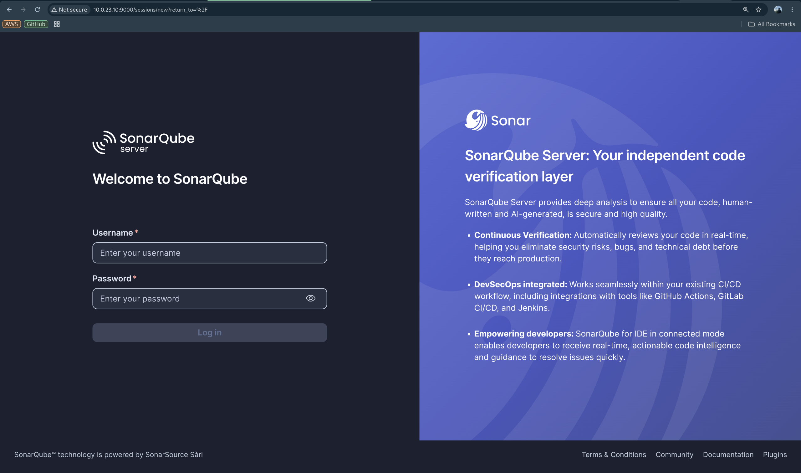
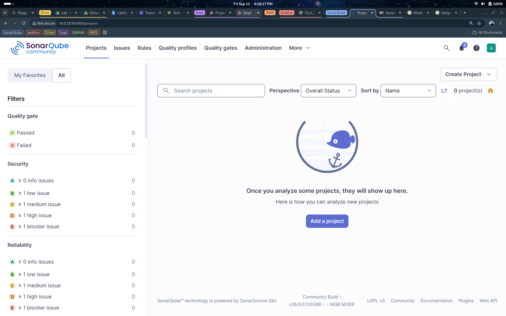
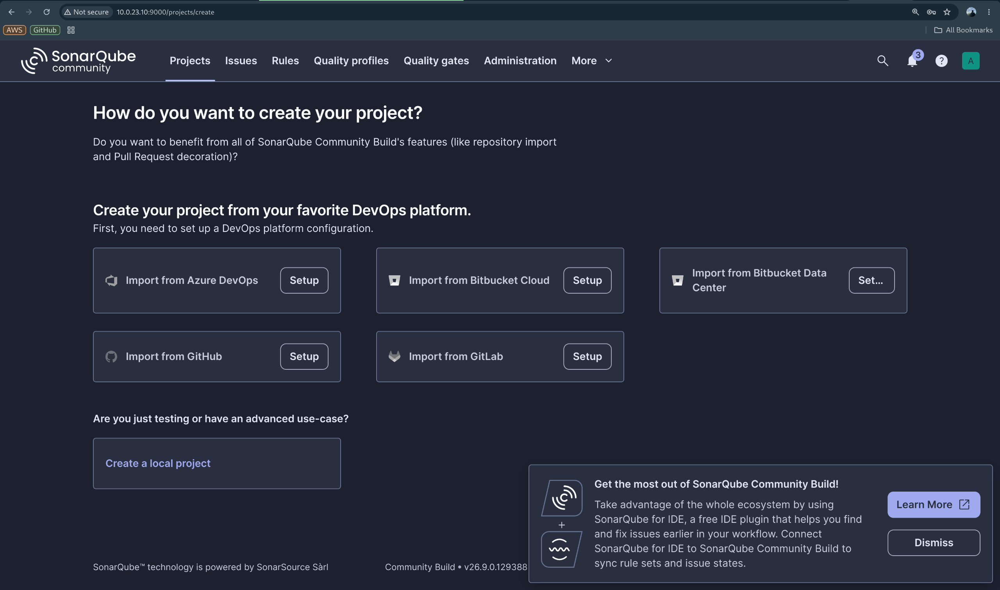
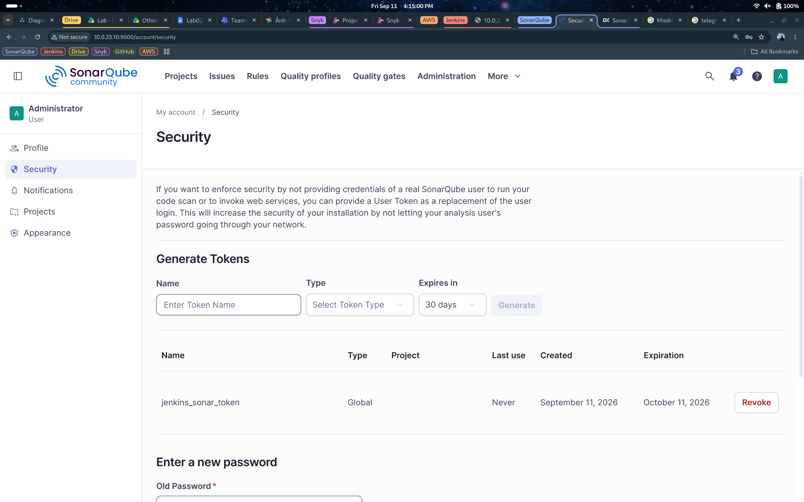

# Ansible Hub for Automation Configuration

## 1. Overview

Ansible Hub centralizes playbooks and roles to automate K0s, Observability, OpenVPN, and related components. The goal is to standardize deployment, make it easy to extend, and simplify troubleshooting.

## 2. Configuration Details

### 2.1 OpenVPN Server
Example command for the staging environment:

```bash
ansible-playbook -i inventories/staging/openvpn.ini playbooks/openvpn_setup.yml
```

Connect to the infrastructure after the configuration is completed:

```bash
sudo openvpn --config ./vpn/devops.ovpn
```

### 2.2 Kubernetes (k0s)
Configure the Kubernetes cluster:

```bash
ansible-playbook -i inventories/staging/kubernetes.ini playbooks/k0s_setup.yml
```

Then fetch the latest kubeconfig from the controller and connect to the cluster:

```bash
ssh -i ../key_pair/k0s_key ubuntu@<MASTER_IP> 'sudo cat /var/lib/k0s/pki/admin.conf' > ~/.kube/k0s-cloud-staging.yaml
sed -i 's#https://localhost:6443#https://<MASTER_IP>:6443#' ~/.kube/k0s-cloud-staging.yaml
export KUBECONFIG=~/.kube/k0s-cloud-staging.yaml
kubectl get nodes -o wide
kubectl get ns
```

Example:

```bash
ssh -i ../key_pair/k0s_key ubuntu@10.0.11.10 'sudo cat /var/lib/k0s/pki/admin.conf' > ~/.kube/k0s-cloud-staging.yaml
sed -i 's#https://localhost:6443#https://10.0.11.10:6443#' ~/.kube/k0s-cloud-staging.yaml
export KUBECONFIG=~/.kube/k0s-cloud-staging.yaml
kubectl get nodes -o wide
kubectl get ns
```

For the staging environment, the ingress-nginx HTTP NodePort is pinned to `30293` so the AWS ALB target group can forward traffic consistently without changing Terraform.

### 2.3 Observability
Observability is deployed via `playbooks/observability_setup.yml` and roles under `roles/observability`.

These playbooks also use the `kubeconfig` role, so you need both:
- The observability inventory
- The Kubernetes inventory for the k0s controller

To deploy the full observability stack (Grafana, Prometheus, Loki, and Tempo), run:

```bash
ansible-playbook \
  -i inventories/staging/observability.ini \
  -i inventories/staging/kubernetes.ini \
  playbooks/observability_setup.yml
```

Or just apply monitoring (Prometheus and Grafana only):

```bash
ansible-playbook \
  -i inventories/staging/observability.ini \
  -i inventories/staging/kubernetes.ini \
  playbooks/monitoring_setup.yml
```

For Alertmanager config, run:

```bash
cp roles/observability/alertmanager/defaults/main.yml.example \
   roles/observability/alertmanager/defaults/main.yml
```

Then fill in the Telegram token and chat ID locally.

#### 2.3.1 Grafana
Dashboards are provisioned automatically from `roles/observability/grafana/files/dashboards`.

**Grafana Login**


**Grafana Console**


#### 2.3.2 Prometheus
Prometheus system metrics dashboard screenshot:


#### 2.3.3 Loki
Loki collects and queries both system logs and application logs.

**Loki Dashboard for System**
System logging dashboard screenshots are stored in `images/`:


**Loki Dashboard for Microservices**
Microservices ([mini-ecommerce](https://github.com/NT114-Q21-Specialized-Project/mini-ecommerce-microservices)) logging dashboard:


### 2.4 MinIO
MinIO is deployed via `playbooks/minio_setup.yml` and role `roles/minio`.

Use inventory generated by Terraform stack `jenkins-kvm-hub/terraform/stacks/minio`:

```bash
ansible-playbook -i inventories/dev/minio.ini playbooks/minio_setup.yml
```

Default endpoints:

- API: `http://192.168.201.30:9000`
- Console: `http://192.168.201.30:9001`

**MinIO Console Login**


Default credentials are defined in `roles/minio/defaults/main.yml` and should be changed before production use.

### 2.6 SonarQube
Terraform generates `inventories/staging/sonarqube.ini` with the private IP of
the SonarQube EC2 instance. Connect to the staging VPN first, then verify the
host is reachable:

```bash
ansible -i inventories/staging/sonarqube.ini sonarqube -m ping
```

Install SonarQube:

```bash
ansible-playbook \
  -i inventories/staging/sonarqube.ini \
  playbooks/sonarqube_install.yml
```

The playbook installs SonarQube Community Build natively on the EC2 instance
with Java 21 and PostgreSQL. It also configures the required Linux kernel
settings, creates a dedicated service user, and runs SonarQube with systemd.

After installation, access the web interface through the VPN:

```text
http://10.0.23.10:9000
```

**SonarQube Login**


**SonarQube Projects Dashboard**



The initial administrator credentials are `admin/admin`. SonarQube requires
the password to be changed after the first login.

**Create a SonarQube Project**



**Create a SonarQube Analysis Token**

Open **My Account > Security** and generate a Global Analysis Token for
Jenkins. Store the token in Ansible Vault as `sonarqube_token`.



To check the service and startup logs:

```bash
ssh -i ../key_pair/k0s_key ubuntu@10.0.23.10
sudo systemctl status sonarqube --no-pager
sudo journalctl -u sonarqube -n 100 --no-pager
```

### 2.7 Jenkins

Terraform generates `inventories/staging/jenkins.ini` with the private IPs of
the Jenkins controller and worker. Connect to the staging VPN first, then run:

```bash
ansible-playbook \
  -i inventories/staging/jenkins.ini \
  playbooks/jenkins_install.yml
```

The playbook installs Jenkins on the controller, prepares the worker with
Docker and CI tools, and configures controller-to-worker SSH automatically.

After Jenkins starts, open `http://10.0.22.10:8080`. Retrieve the initial
administrator password from the controller with:

```bash
ansible \
  -i inventories/staging/jenkins.ini \
  jenkins_master \
  --become \
  -m command \
  -a "cat /var/lib/jenkins/secrets/initialAdminPassword"
```

Credentials are optional (GitHub, Docker Hub, SonarQube, Snyk, and others). To provide them through
Ansible Vault:

```bash
cp secrets.yml.example secrets.yml
ansible-vault encrypt secrets.yml
ansible-playbook \
  -i inventories/staging/jenkins.ini \
  playbooks/jenkins_install.yml \
  --ask-vault-pass \
  --extra-vars @secrets.yml
```

### 2.8 Snyk

Snyk CLI runs on the Jenkins worker. The Snyk API token is stored in the
encrypted `secrets.yml` file and provisioned on the Jenkins controller as a
Secret text credential with the ID `snyk-token`.

Create an API token in Snyk, then add it to the existing Vault file:

```bash
EDITOR=nano ansible-vault edit secrets.yml
```

```yaml
snyk_token: "<SNYK_API_TOKEN>"
```

Apply the Jenkins playbook to install Snyk CLI on the worker and update the
Jenkins credential:

```bash
ansible-playbook \
  -i inventories/staging/jenkins.ini \
  playbooks/jenkins_install.yml \
  --ask-vault-pass \
  --extra-vars @secrets.yml
```

Verify the CLI installation on the Jenkins worker:

```bash
ansible \
  -i inventories/staging/jenkins.ini \
  jenkins_workers \
  --become \
  -a "snyk --version"
```

The application `Jenkinsfile` injects `snyk-token` only while the Snyk
dependency stage is running. It scans each service dependency manifest before
the image is built. A High or Critical vulnerability fails that service
pipeline, and `snyk monitor` publishes the latest result to Snyk.io. Trivy
scans the built container image separately.
